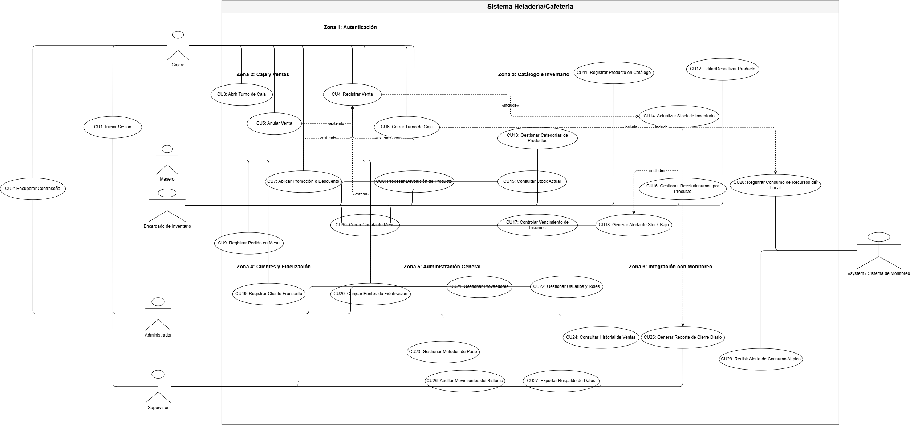
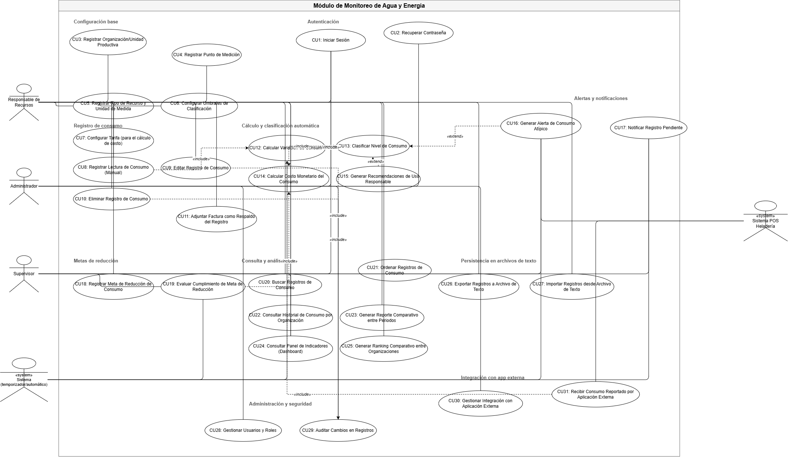
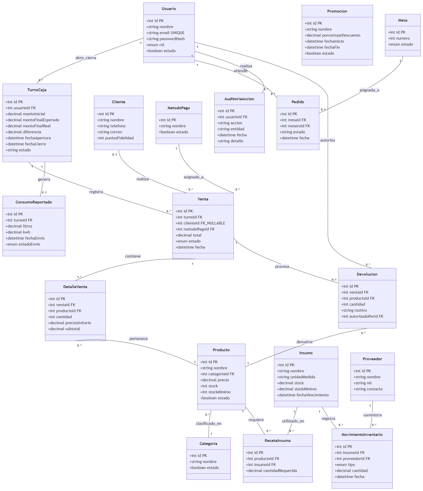
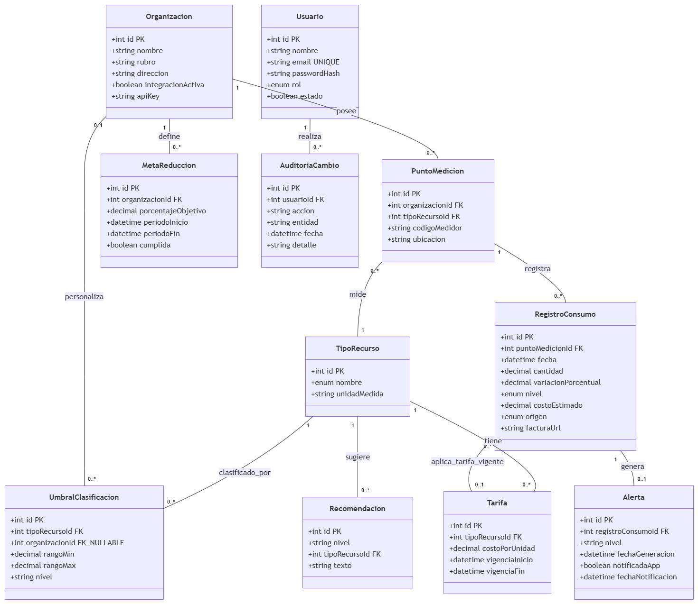

# Sistema de Gestión para Heladería Cafetería con Módulo Integrado de Monitoreo de Consumo de Agua y Energía

**Universidad:** [PENDIENTE: universidad]  
**Facultad:** [PENDIENTE: facultad]  
**Carrera:** [PENDIENTE: carrera]  
**Asignatura:** Programación Web II  
**Integrantes:** [PENDIENTE: integrantes]  
**Docente:** [PENDIENTE: docente]  
**Gestión y fecha:** [PENDIENTE: gestión y fecha]

## Hoja de control documental
| Versión | Fecha | Descripción del cambio | Responsable |
| --- | --- | --- | --- |
| 1.0 | 2026-09-30 | Elaboración inicial basada en el repositorio | [PENDIENTE] |

## Índice general
1. Introducción
2. Ingeniería de requisitos
3. Modelado UML
4. Base de datos
5. Arquitectura del sistema
6. Desarrollo del sistema
7. Implementación con Docker
8. Investigación
9. Pruebas
10. Manual de instalación
11. Manual de despliegue
12. Conclusiones y recomendaciones
Referencias y anexos

## Índice de figuras
1. Casos de uso del POS
2. Casos de uso del módulo de monitoreo
3. Modelo entidad relación del POS
4. Modelo entidad relación del monitoreo

## CAPÍTULO I. INTRODUCCIÓN

### Antecedentes
La operación de una heladería/cafetería combina ventas, caja, pedidos, inventario y atención al cliente. Cuando estos procesos se registran por separado, se dificulta mantener la trazabilidad de stock, pagos y turnos. En paralelo, la medición del uso de agua y energía permite identificar consumos que requieren atención. El proyecto integra ambos dominios sin mezclar sus datos: el POS reporta consumos mediante una API y el módulo de monitoreo los procesa y alerta.

### Planteamiento del problema
Se requiere centralizar la operación diaria del local y disponer de un mecanismo confiable para registrar, clasificar y notificar consumos de recursos. El reto técnico consiste en preservar la autonomía de las dos aplicaciones y, al mismo tiempo, tolerar fallas temporales de comunicación mediante colas, reintentos e idempotencia.

### Justificación
Técnicamente, la solución aplica una arquitectura por capas, autenticación JWT, RBAC, RLS y transacciones. Socialmente, contribuye a visualizar el uso responsable de agua y energía. Académicamente, integra desarrollo web, bases de datos, seguridad, APIs REST y contenedores.

### Objetivos
**Objetivo general.** Desarrollar un sistema de gestión para una heladería/cafetería integrado, mediante API REST, con un módulo de monitoreo de agua y energía.

**Objetivos específicos.** Registrar ventas, turnos, pedidos e inventario; preservar la trazabilidad de las operaciones; reportar consumos desde el POS; clasificar consumos y generar alertas; aplicar controles de autenticación, autorización e infraestructura reproducible.

### Alcance, limitaciones, eje transversal y ODS
El alcance abarca las aplicaciones POS y Monitoreo, sus frontends React, backends Express, PostgreSQL/Supabase, contratos y despliegue local con Docker. No existe evidencia de una URL pública ni de capturas de ejecución; por ello se consignan como pendientes. El eje transversal es el uso responsable de recursos. El proyecto se alinea con el ODS 6 al registrar consumo de agua, con el ODS 7 al monitorear energía y con el ODS 12 al apoyar decisiones operativas basadas en consumo.

## CAPÍTULO II. INGENIERÍA DE REQUERIMIENTOS

### Requerimientos funcionales
| Código | Descripción | Módulo |
| --- | --- | --- |
| RF01 | Registrar venta normal, multiproducto y pagos divididos | Ventas |
| RF02 | Rechazar ventas sin stock y restaurar stock en anulaciones/devoluciones | Ventas e inventario |
| RF03 | Abrir un único turno por cajero y calcular cierre/diferencia | Caja |
| RF04 | Gestionar mesas, pedidos y estados de pedido | Pedidos |
| RF05 | Gestionar insumos, proveedores y movimientos de inventario | Inventario |
| RF06 | Gestionar productos, categorías y recetas | Catálogo |
| RF07 | Gestionar clientes, puntos, promociones y sus validaciones | Clientes y promociones |
| RF08 | Autenticar con JWT y autorizar con RBAC | Seguridad |
| RF09 | Enviar consumos con reintento y recibir alertas idempotentes | Integración |
| RF10 | Registrar, clasificar y alertar consumos por organización | Monitoreo |
| RF11 | Gestionar metas, tarifas y recomendaciones | Monitoreo |

### Requerimientos no funcionales
| Código | Categoría | Criterio verificable en el repositorio |
| --- | --- | --- |
| RNF01 | Seguridad | JWT, RBAC, RLS, validación y encabezados de seguridad. |
| RNF02 | Integridad | Transacciones y funciones PostgreSQL para operaciones críticas. |
| RNF03 | Disponibilidad | Colas, reintentos, backoff y health checks. |
| RNF04 | Trazabilidad | Auditoría y movimientos de inventario/puntos. |
| RNF05 | Portabilidad | Contenedores Docker y manifiestos Kubernetes. |
| RNF06 | Mantenibilidad | Separación routes, controllers, services, repositories y models. |
| RNF07 | Usabilidad | Interfaces React separadas por dominio. |
| RNF08 | Interoperabilidad | Contratos versionados consumption.v1 y alerts.v1. |

### Reglas de negocio y restricciones
Un cajero mantiene un solo turno abierto; una venta anulada conserva historial; no se devuelve más de lo vendido; las operaciones relevantes restauran stock e insumos; los puntos dejan movimiento trazable; los consumos y alertas se deduplican mediante identificadores externos o claves de idempotencia; los umbrales no deben solaparse; las metas aceptan porcentajes de 0 a 100; y las tarifas validan períodos. POS y Monitoreo son propietarios de sus propios datos y no poseen claves foráneas cruzadas.

## CAPÍTULO III. MODELADO UML
### Casos de uso
Como se observa en la Figura 1, el POS contempla a cajero, mesero, encargado de inventario, administrador, supervisor y sistema de monitoreo. Sus casos cubren ventas, turnos, pedidos, catálogo, inventario, clientes, promociones, devoluciones e integración. La Figura 2 presenta responsables de recursos, administrador, supervisor, POS y sistema externo; incluye recepción, registro, clasificación, alertas, metas, tarifas, notificaciones, recomendaciones y reportes.





### Descripción de casos de uso
| Caso | Actor | Precondición | Flujo principal | Alternativo/excepción | Postcondición |
| --- | --- | --- | --- | --- | --- |
| Registrar venta | Cajero | JWT válido, permiso y turno abierto | Valida productos, stock, total y pagos; registra venta y descuenta existencias. | Stock o pagos inválidos: rechaza la operación. | Venta activa, movimientos y auditoría. |
| Cerrar turno | Cajero | Turno abierto propio | Calcula ventas, efectivo esperado, diferencia y consumo. | Monto final inválido: rechaza. | Turno cerrado y eventos de integración. |
| Anular venta | Supervisor | Venta activa y permiso | Verifica estado, restaura existencias y audita. | Venta inexistente o anulada: rechaza. | Venta anulada con historial. |
| Procesar devolución | Usuario autorizado | Venta y cantidades válidas | Valida límite, registra devolución y restituye stock. | Cantidad superior a la vendida: rechaza. | Devolución y trazabilidad. |
| Recibir consumo reportado | Sistema POS | Credencial de integración válida | Valida contrato y clave idempotente; registra recepción y encola. | Duplicado: informa recepción previa. | Consumo recibido una sola vez. |
| Clasificar consumo | Worker de monitoreo | Registro de consumo pendiente | Compara con umbrales de recurso y periodo. | Sin umbral aplicable: queda sin clasificación verificable. | Nivel de clasificación asignado. |
| Generar alerta | Worker de monitoreo | Exceso clasificado | Crea alerta y entrega para POS. | Sin destinatario/configuración: queda pendiente. | Alerta registrada y encolada. |

### Diagrama de clases
Las clases principales del POS son Usuario, Rol, Permiso, TurnoCaja, Venta, DetalleVenta, Pago, Producto, Insumo, RecetaInsumo, MovimientoInventario, Cliente, MovimientoPuntos, Pedido, Mesa, Promocion, ConsumoReportado y ColaIntegracion. En Monitoreo se organizan Organizacion, UsuarioOrganizacion, PuntoMedicion, TipoRecurso, RegistroConsumo, UmbralClasificacion, Alerta, Notificacion, MetaReduccion, Tarifa, Recomendacion, RecepcionConsumoPOS y ColaProcesamiento. Las asociaciones internas materializan cardinalidades de propiedad; la integración entre aplicaciones se expresa únicamente por contratos REST.

## CAPÍTULO IV. BASE DE DATOS
### Modelo relacional
La Figura 3 y la Figura 4 muestran dos modelos relacionales independientes. No existe una FK entre ambos esquemas: los identificadores externos se intercambian por las APIs de integración.





### Diccionario de datos
El siguiente diccionario se genera de las sentencias `CREATE TABLE` disponibles en las migraciones canónicas. Las marcas PK, FK y NN proceden de la misma definición; si una migración no contiene una tabla se evita inferirla.

#### POS

**alerta_pos** (fuente: `database/pos/migrations/AlertaPos.js`)

| Columna | Tipo | Restricción |
| --- | --- | --- |
| id_alerta | UUID | PK |
| turno_id | UUID | FK [ver asociación Sequelize] |
| tipo | STRING | NN |
| nivel | STRING | NN |
| mensaje | TEXT | NN |
| estado | STRING | — |
| creado_en | DATE | — |
| atendido_en | DATE | — |
| atendido_por | UUID | — |

**auditoria_accion** (fuente: `database/pos/migrations/AuditoriaAccion.js`)

| Columna | Tipo | Restricción |
| --- | --- | --- |
| id_auditoria | UUID | PK |
| usuario_id | UUID | FK [ver asociación Sequelize] |
| accion | STRING | NN |
| entidad | STRING | — |
| entidad_id | UUID | FK [ver asociación Sequelize] |
| resultado | STRING | — |
| direccion_ip | STRING | — |
| user_agent | STRING | — |
| fecha | DATE | — |
| detalle | TEXT | — |

**categoria** (fuente: `database/pos/migrations/Categoria.js`)

| Columna | Tipo | Restricción |
| --- | --- | --- |
| id_categoria | UUID | PK |
| nombre | STRING | NN |
| estado | STRING | — |

**cliente** (fuente: `database/pos/migrations/Cliente.js`)

| Columna | Tipo | Restricción |
| --- | --- | --- |
| id_cliente | UUID | PK |
| nombre | STRING | NN |
| telefono | STRING | — |
| correo | STRING | — |
| puntos_fidelidad | INTEGER | — |
| estado | STRING | — |
| creado_en | DATE | Generado por Sequelize |
| actualizado_en | DATE | Generado por Sequelize |

**cola_integracion** (fuente: `database/pos/migrations/ColaIntegracion.js`)

| Columna | Tipo | Restricción |
| --- | --- | --- |
| id_cola | UUID | PK |
| consumo_id | UUID | NN; FK [ver asociación Sequelize] |
| operacion | STRING | NN |
| idempotency_key | STRING | NN |
| intentos | INTEGER | — |
| estado | STRING | — |
| respuesta | TEXT | — |
| error | TEXT | — |
| proximo_intento | DATE | — |
| ultimo_intento | DATE | — |
| creado_en | DATE | — |

**configuracion_pos** (fuente: `database/pos/migrations/ConfiguracionPos.js`)

| Columna | Tipo | Restricción |
| --- | --- | --- |
| id_configuracion | UUID | PK |
| clave | STRING | NN |
| valor | STRING | NN |
| descripcion | TEXT | — |
| actualizado_en | DATE | — |

**consumo_reportado** (fuente: `database/pos/migrations/ConsumoReportado.js`)

| Columna | Tipo | Restricción |
| --- | --- | --- |
| id_consumo | UUID | PK |
| turno_id | UUID | NN; FK [ver asociación Sequelize] |
| tipo_recurso | STRING | NN |
| cantidad | DECIMAL | NN |
| unidad_medida | STRING | NN |
| fecha_consumo | DATE | — |
| estado | STRING | — |
| fecha_creacion | DATE | — |

**detalle_pedido** (fuente: `database/pos/migrations/DetallePedido.js`)

| Columna | Tipo | Restricción |
| --- | --- | --- |
| id_detalle_pedido | UUID | PK |
| pedido_id | UUID | NN; FK [ver asociación Sequelize] |
| producto_id | UUID | NN; FK [ver asociación Sequelize] |
| cantidad | DECIMAL | NN |
| precio_unitario | DECIMAL | NN |
| observacion | TEXT | — |
| subtotal | DECIMAL | NN |

**detalle_venta** (fuente: `database/pos/migrations/DetalleVenta.js`)

| Columna | Tipo | Restricción |
| --- | --- | --- |
| id_detalle_venta | UUID | PK |
| venta_id | UUID | NN; FK [ver asociación Sequelize] |
| producto_id | UUID | NN; FK [ver asociación Sequelize] |
| cantidad | DECIMAL | NN |
| precio_unitario | DECIMAL | NN |
| descuento | DECIMAL | — |
| subtotal | DECIMAL | NN |

**devolucion** (fuente: `database/pos/migrations/Devolucion.js`)

| Columna | Tipo | Restricción |
| --- | --- | --- |
| id_devolucion | UUID | PK |
| venta_id | UUID | NN; FK [ver asociación Sequelize] |
| producto_id | UUID | NN; FK [ver asociación Sequelize] |
| autorizado_por_id | UUID | FK [ver asociación Sequelize] |
| cantidad | DECIMAL | NN |
| monto | DECIMAL | NN |
| motivo | TEXT | — |
| estado | STRING | — |
| fecha | DATE | — |

**entrega_alerta** (fuente: `database/pos/migrations/EntregaAlerta.js`)

| Columna | Tipo | Restricción |
| --- | --- | --- |
| id_entrega | UUID | PK |
| alerta_externa_id | UUID | NN; FK [ver asociación Sequelize] |
| nivel | STRING | NN |
| tipo | STRING | NN |
| mensaje | TEXT | NN |
| estado | STRING | — |
| intentos | INTEGER | — |
| fecha_recepcion | DATE | — |
| fecha_procesamiento | DATE | — |

**equipo_consumo** (fuente: `database/pos/migrations/EquipoConsumo.js`)

| Columna | Tipo | Restricción |
| --- | --- | --- |
| id_equipo | UUID | PK |
| nombre | STRING | NN |
| tipo_recurso | STRING | NN |
| consumo_por_hora | DECIMAL | NN |
| unidad_medida | STRING | NN |
| activo | BOOLEAN | — |
| creado_en | DATE | Generado por Sequelize |
| actualizado_en | DATE | Generado por Sequelize |

**equipo_turno** (fuente: `database/pos/migrations/EquipoTurno.js`)

| Columna | Tipo | Restricción |
| --- | --- | --- |
| id_equipo_turno | UUID | PK |
| equipo_id | UUID | NN; FK [ver asociación Sequelize] |
| turno_id | UUID | NN; FK [ver asociación Sequelize] |
| hora_inicio | DATE | NN |
| hora_fin | DATE | — |
| estado | STRING | — |
| creado_en | DATE | Generado por Sequelize |
| actualizado_en | DATE | Generado por Sequelize |

**insumo** (fuente: `database/pos/migrations/Insumo.js`)

| Columna | Tipo | Restricción |
| --- | --- | --- |
| id_insumo | UUID | PK |
| nombre | STRING | NN |
| unidad_medida | STRING | — |
| stock | DECIMAL | — |
| stock_minimo | DECIMAL | — |
| fecha_vencimiento | DATE | — |
| estado | STRING | — |

**mesa** (fuente: `database/pos/migrations/Mesa.js`)

| Columna | Tipo | Restricción |
| --- | --- | --- |
| id_mesa | UUID | PK |
| numero | INTEGER | NN |
| estado | STRING | — |

**metodo_pago** (fuente: `database/pos/migrations/MetodoPago.js`)

| Columna | Tipo | Restricción |
| --- | --- | --- |
| id_metodo_pago | UUID | PK |
| nombre | STRING | NN |
| estado | STRING | — |

**movimiento_inventario** (fuente: `database/pos/migrations/MovimientoInventario.js`)

| Columna | Tipo | Restricción |
| --- | --- | --- |
| id_movimiento | UUID | PK |
| insumo_id | UUID | FK [ver asociación Sequelize] |
| proveedor_id | UUID | FK [ver asociación Sequelize] |
| usuario_id | UUID | FK [ver asociación Sequelize] |
| producto_id | UUID | FK [ver asociación Sequelize] |
| venta_id | UUID | FK [ver asociación Sequelize] |
| devolucion_id | UUID | FK [ver asociación Sequelize] |
| tipo | STRING | NN |
| cantidad | DECIMAL | NN |
| motivo | STRING | — |
| fecha | DATE | — |

**movimiento_puntos** (fuente: `database/pos/migrations/MovimientoPuntos.js`)

| Columna | Tipo | Restricción |
| --- | --- | --- |
| id_movimiento | UUID | PK |
| cliente_id | UUID | NN; FK [ver asociación Sequelize] |
| venta_id | UUID | FK [ver asociación Sequelize] |
| puntos | INTEGER | NN |
| tipo | STRING | NN |
| motivo | STRING | — |
| fecha | DATE | — |

**pago** (fuente: `database/pos/migrations/Pago.js`)

| Columna | Tipo | Restricción |
| --- | --- | --- |
| id_pago | UUID | PK |
| venta_id | UUID | NN; FK [ver asociación Sequelize] |
| metodo_pago_id | UUID | NN; FK [ver asociación Sequelize] |
| monto | DECIMAL | NN |
| referencia | STRING | — |
| estado | STRING | — |
| fecha | DATE | — |

**pedido** (fuente: `database/pos/migrations/Pedido.js`)

| Columna | Tipo | Restricción |
| --- | --- | --- |
| id_pedido | UUID | PK |
| mesa_id | UUID | FK [ver asociación Sequelize] |
| mesero_id | UUID | FK [ver asociación Sequelize] |
| estado | STRING | — |
| fecha | DATE | — |
| fecha_cierre | DATE | — |

**permiso** (fuente: `database/pos/migrations/Permiso.js`)

| Columna | Tipo | Restricción |
| --- | --- | --- |
| id_permiso | UUID | PK |
| nombre | STRING | NN |
| descripcion | STRING | — |
| modulo | STRING | — |

**producto** (fuente: `database/pos/migrations/Producto.js`)

| Columna | Tipo | Restricción |
| --- | --- | --- |
| id_producto | UUID | PK |
| categoria_id | UUID | FK [ver asociación Sequelize] |
| nombre | STRING | NN |
| precio | DECIMAL | NN |
| imagen_url | TEXT | — |
| stock | DECIMAL | — |
| stock_minimo | DECIMAL | — |
| estado | STRING | — |
| creado_en | DATE | Generado por Sequelize |
| actualizado_en | DATE | Generado por Sequelize |

**promocion** (fuente: `database/pos/migrations/Promocion.js`)

| Columna | Tipo | Restricción |
| --- | --- | --- |
| id_promocion | UUID | PK |
| nombre | STRING | NN |
| porcentaje_descuento | DECIMAL | NN |
| fecha_inicio | DATE | — |
| fecha_fin | DATE | — |
| estado | STRING | — |

**promocion_producto** (fuente: `database/pos/migrations/PromocionProducto.js`)

| Columna | Tipo | Restricción |
| --- | --- | --- |
| id_promocion_producto | UUID | PK |
| promocion_id | UUID | NN; FK [ver asociación Sequelize] |
| producto_id | UUID | NN; FK [ver asociación Sequelize] |

**proveedor** (fuente: `database/pos/migrations/Proveedor.js`)

| Columna | Tipo | Restricción |
| --- | --- | --- |
| id_proveedor | UUID | PK |
| nombre | STRING | NN |
| nit | STRING | — |
| contacto | STRING | — |
| telefono | STRING | — |
| correo | STRING | — |
| estado | STRING | — |

**receta_insumo** (fuente: `database/pos/migrations/RecetaInsumo.js`)

| Columna | Tipo | Restricción |
| --- | --- | --- |
| id_receta | UUID | PK |
| producto_id | UUID | NN; FK [ver asociación Sequelize] |
| insumo_id | UUID | NN; FK [ver asociación Sequelize] |
| cantidad_requerida | DECIMAL | NN |

**rol** (fuente: `database/pos/migrations/Rol.js`)

| Columna | Tipo | Restricción |
| --- | --- | --- |
| id_rol | UUID | PK |
| nombre | STRING | NN |
| descripcion | STRING | — |
| estado | STRING | — |

**rol_permiso** (fuente: `database/pos/migrations/RolPermiso.js`)

| Columna | Tipo | Restricción |
| --- | --- | --- |
| id_rol_permiso | UUID | PK |
| rol_id | UUID | NN; FK [ver asociación Sequelize] |
| permiso_id | UUID | NN; FK [ver asociación Sequelize] |

**turno_caja** (fuente: `database/pos/migrations/TurnoCaja.js`)

| Columna | Tipo | Restricción |
| --- | --- | --- |
| id_turno | UUID | PK |
| usuario_id | UUID | NN; FK [ver asociación Sequelize] |
| monto_inicial | DECIMAL | NN |
| monto_final_esperado | DECIMAL | — |
| monto_final_real | DECIMAL | — |
| diferencia | DECIMAL | — |
| fecha_apertura | DATE | — |
| fecha_cierre | DATE | — |
| estado | STRING | — |

**users** (fuente: `database/pos/migrations/Usuario.js`)

| Columna | Tipo | Restricción |
| --- | --- | --- |
| nombre | STRING | NN |
| email | STRING | NN |
| rol_id | UUID | FK [ver asociación Sequelize] |
| estado | STRING | — |
| creado_en | DATE | Generado por Sequelize |
| actualizado_en | DATE | Generado por Sequelize |

**venta** (fuente: `database/pos/migrations/Venta.js`)

| Columna | Tipo | Restricción |
| --- | --- | --- |
| id_venta | UUID | PK |
| turno_id | UUID | NN; FK [ver asociación Sequelize] |
| cliente_id | UUID | FK [ver asociación Sequelize] |
| pedido_id | UUID | FK [ver asociación Sequelize] |
| subtotal | DECIMAL | — |
| descuento | DECIMAL | — |
| total | DECIMAL | NN |
| estado | STRING | — |
| motivo_anulacion | TEXT | — |
| fecha | DATE | — |
| idempotency_key | STRING | — |

#### Monitoreo

**organizacion** (fuente: `database/monitoreo/001_v1_0_monitoreo_ddl.sql`)

| Columna | Tipo | Restricción |
| --- | --- | --- |
| id | UUID PRIMARY | PK |
| nombre | TEXT NOT | NN |
| nit | TEXT UNIQUE | — |
| estado | TEXT NOT | NN |
| creado_en | TIMESTAMPTZ NOT | NN |

**usuario** (fuente: `database/monitoreo/001_v1_0_monitoreo_ddl.sql`)

| Columna | Tipo | Restricción |
| --- | --- | --- |
| id | UUID PRIMARY | PK |
| email | TEXT NOT | NN |
| nombre | TEXT | — |
| estado | TEXT NOT | NN |
| creado_en | TIMESTAMPTZ NOT | NN |

**rol** (fuente: `database/monitoreo/001_v1_0_monitoreo_ddl.sql`)

| Columna | Tipo | Restricción |
| --- | --- | --- |
| id | UUID PRIMARY | PK |
| nombre | TEXT NOT | NN |
| estado | TEXT NOT | NN |

**permiso** (fuente: `database/monitoreo/001_v1_0_monitoreo_ddl.sql`)

| Columna | Tipo | Restricción |
| --- | --- | --- |
| id | UUID PRIMARY | PK |
| nombre | TEXT NOT | NN |

**rol_permiso** (fuente: `database/monitoreo/001_v1_0_monitoreo_ddl.sql`)

| Columna | Tipo | Restricción |
| --- | --- | --- |
| id | UUID PRIMARY | PK |
| rol_id | UUID NOT | NN; FK |
| permiso_id | UUID NOT | NN; FK |

**usuario_organizacion** (fuente: `database/monitoreo/001_v1_0_monitoreo_ddl.sql`)

| Columna | Tipo | Restricción |
| --- | --- | --- |
| id | UUID PRIMARY | PK |
| usuario_id | UUID NOT | NN; FK |
| organizacion_id | UUID NOT | NN; FK |
| rol_id | UUID NOT | NN; FK |
| estado | TEXT NOT | NN |
| creado_en | TIMESTAMPTZ NOT | NN |

**integracion** (fuente: `database/monitoreo/001_v1_0_monitoreo_ddl.sql`)

| Columna | Tipo | Restricción |
| --- | --- | --- |
| id | UUID PRIMARY | PK |
| organizacion_id | UUID NOT | NN; FK |
| nombre | TEXT NOT | NN |
| api_key_hash | TEXT NOT | NN |
| estado | TEXT NOT | NN |
| ultimo_uso_en | TIMESTAMPTZ | — |
| creado_en | TIMESTAMPTZ NOT | NN |

**tipo_recurso** (fuente: `database/monitoreo/001_v1_0_monitoreo_ddl.sql`)

| Columna | Tipo | Restricción |
| --- | --- | --- |
| id | UUID PRIMARY | PK |
| codigo | TEXT NOT | NN |
| nombre | TEXT NOT | NN |
| unidad_base | TEXT NOT | NN |

**punto_medicion** (fuente: `database/monitoreo/001_v1_0_monitoreo_ddl.sql`)

| Columna | Tipo | Restricción |
| --- | --- | --- |
| id | UUID PRIMARY | PK |
| organizacion_id | UUID NOT | NN; FK |
| tipo_recurso_id | UUID NOT | NN; FK |
| codigo_medidor | TEXT NOT | NN |
| nombre | TEXT NOT | NN |
| estado | TEXT NOT | NN |
| creado_en | TIMESTAMPTZ NOT | NN |

**recepcion_consumo_pos** (fuente: `database/monitoreo/001_v1_0_monitoreo_ddl.sql`)

| Columna | Tipo | Restricción |
| --- | --- | --- |
| id | UUID PRIMARY | PK |
| consumo_externo_id | UUID NOT | NN |
| idempotency_key | TEXT NOT | NN |
| organizacion_id | UUID NOT | NN; FK |
| punto_medicion_id | UUID REFERENCES | FK |
| tipo_recurso | TEXT NOT | NN |
| cantidad | NUMERIC(14,3) NOT | NN |
| unidad_medida | TEXT NOT | NN |
| fecha_consumo | TIMESTAMPTZ NOT | NN |
| origen | TEXT NOT | NN |
| estado | TEXT NOT | NN |
| recepcionado_en | TIMESTAMPTZ NOT | NN |

**cola_procesamiento** (fuente: `database/monitoreo/001_v1_0_monitoreo_ddl.sql`)

| Columna | Tipo | Restricción |
| --- | --- | --- |
| id | UUID PRIMARY | PK |
| recepcion_id | UUID NOT | NN; FK |
| estado | TEXT NOT | NN |
| intentos | INT NOT | NN |
| proximo_intento | TIMESTAMPTZ | — |
| ultimo_error | TEXT | — |
| creado_en | TIMESTAMPTZ NOT | NN |

**registro_consumo** (fuente: `database/monitoreo/001_v1_0_monitoreo_ddl.sql`)

| Columna | Tipo | Restricción |
| --- | --- | --- |
| id | UUID PRIMARY | PK |
| recepcion_id | UUID NOT | NN; FK |
| organizacion_id | UUID NOT | NN; FK |
| punto_medicion_id | UUID REFERENCES | FK |
| tipo_recurso_id | UUID NOT | NN; FK |
| tipo_recurso | TEXT NOT | NN |
| cantidad | NUMERIC(14,3) NOT | NN |
| unidad_medida | TEXT NOT | NN |
| fecha_consumo | TIMESTAMPTZ NOT | NN |
| clasificacion | TEXT NOT | NN |
| origen | TEXT NOT | NN |
| creado_en | TIMESTAMPTZ NOT | NN |

**umbral_clasificacion** (fuente: `database/monitoreo/001_v1_0_monitoreo_ddl.sql`)

| Columna | Tipo | Restricción |
| --- | --- | --- |
| id | UUID PRIMARY | PK |
| organizacion_id | UUID NOT | NN; FK |
| tipo_recurso_id | UUID NOT | NN; FK |
| nombre | TEXT NOT | NN |
| nivel | TEXT NOT | NN |
| limite_inferior | NUMERIC(14,3) NOT | NN |
| limite_superior | NUMERIC(14,3) NOT | NN |
| estado | TEXT NOT | NN |
| creado_en | TIMESTAMPTZ NOT | NN |

**alerta** (fuente: `database/monitoreo/001_v1_0_monitoreo_ddl.sql`)

| Columna | Tipo | Restricción |
| --- | --- | --- |
| id | UUID PRIMARY | PK |
| organizacion_id | UUID NOT | NN; FK |
| registro_consumo_id | UUID REFERENCES | FK |
| umbral_id | UUID REFERENCES | FK |
| nivel | TEXT NOT | NN |
| tipo_recurso | TEXT NOT | NN |
| mensaje | TEXT NOT | NN |
| fecha_generacion | TIMESTAMPTZ NOT | NN |
| estado | TEXT NOT | NN |
| creado_en | TIMESTAMPTZ NOT | NN |

**notificacion** (fuente: `database/monitoreo/001_v1_0_monitoreo_ddl.sql`)

| Columna | Tipo | Restricción |
| --- | --- | --- |
| id | UUID PRIMARY | PK |
| alerta_id | UUID NOT | NN; FK |
| usuario_id | UUID REFERENCES | FK |
| canal | TEXT NOT | NN |
| estado | TEXT NOT | NN |
| creada_en | TIMESTAMPTZ NOT | NN |
| vista_en | TIMESTAMPTZ | — |

**entrega_alerta** (fuente: `database/monitoreo/001_v1_0_monitoreo_ddl.sql`)

| Columna | Tipo | Restricción |
| --- | --- | --- |
| id | UUID PRIMARY | PK |
| alerta_id | UUID NOT | NN; FK |
| estado | TEXT NOT | NN |
| intentos | INT NOT | NN |
| proximo_intento | TIMESTAMPTZ | — |
| ultimo_error | TEXT | — |
| creada_en | TIMESTAMPTZ NOT | NN |

**meta_reduccion** (fuente: `database/monitoreo/001_v1_0_monitoreo_ddl.sql`)

| Columna | Tipo | Restricción |
| --- | --- | --- |
| id | UUID PRIMARY | PK |
| organizacion_id | UUID NOT | NN; FK |
| tipo_recurso_id | UUID NOT | NN; FK |
| nombre | TEXT NOT | NN |
| porcentaje_reduccion | NUMERIC(5,2) NOT | NN |
| fecha_inicio | DATE NOT | NN |
| fecha_fin | DATE NOT | NN |
| estado | TEXT NOT | NN |
| creado_en | TIMESTAMPTZ NOT | NN |

**tarifa** (fuente: `database/monitoreo/001_v1_0_monitoreo_ddl.sql`)

| Columna | Tipo | Restricción |
| --- | --- | --- |
| id | UUID PRIMARY | PK |
| organizacion_id | UUID REFERENCES | FK |
| tipo_recurso_id | UUID NOT | NN; FK |
| nombre | TEXT NOT | NN |
| monto | NUMERIC(14,4) NOT | NN |
| unidad | TEXT NOT | NN |
| fecha_inicio | DATE NOT | NN |
| fecha_fin | DATE NOT | NN |
| creado_en | TIMESTAMPTZ NOT | NN |

**recomendacion** (fuente: `database/monitoreo/001_v1_0_monitoreo_ddl.sql`)

| Columna | Tipo | Restricción |
| --- | --- | --- |
| id | UUID PRIMARY | PK |
| organizacion_id | UUID NOT | NN; FK |
| titulo | TEXT NOT | NN |
| descripcion | TEXT NOT | NN |
| prioridad | TEXT NOT | NN |
| estado | TEXT NOT | NN |
| creada_en | TIMESTAMPTZ NOT | NN |

**auditoria_cambio** (fuente: `database/monitoreo/001_v1_0_monitoreo_ddl.sql`)

| Columna | Tipo | Restricción |
| --- | --- | --- |
| id | UUID PRIMARY | PK |
| entidad | TEXT NOT | NN |
| entidad_id | UUID | — |
| accion | TEXT NOT | NN |
| usuario_id | UUID | — |
| req_id | TEXT | — |
| detalle | JSONB | — |
| creado_en | TIMESTAMPTZ NOT | NN |

La convención del proyecto prioriza UUID para claves y NUMERIC para cantidades o dinero, evitando float en operaciones sensibles.

## CAPÍTULO V. ARQUITECTURA DEL SISTEMA
### Arquitectura lógica
El diseño previsto sigue routes → controllers → services → repositories → models. La documentación de arquitectura advierte que, en el POS, existen handlers inline y los controladores son una abstracción futura; esta es una inconsistencia entre el objetivo por capas y parte de la implementación actual.

### Arquitectura física y de despliegue
Docker Compose define cuatro servicios: pos-backend (3000), monitoreo-backend (4000), pos-frontend (5173 a 80) y monitoreo-frontend (5174 a 80). Las bases PostgreSQL/Supabase son gestionadas externamente. Kubernetes incluye namespace, deployments, services, ingress, ConfigMap, secretos de ejemplo y HPA. AWS se encuentra previsto, sin una arquitectura IaC verificable.

```text
POS frontend -> POS backend -> PostgreSQL/Supabase
                         | ColaIntegracion -> API Monitoreo -> cola -> RegistroConsumo -> Alerta
Monitoreo frontend -> Monitoreo backend -> PostgreSQL/Supabase                 -> API POS
```

## CAPÍTULO VI. DESARROLLO DEL SISTEMA
### Tecnologías y estructura
| Capa | Tecnología real | Evidencia |
| --- | --- | --- |
| Frontend | React 18 POS y React 19 Monitoreo con Vite | pos/frontend y monitoreo/frontend |
| Backend | Node.js y Express 5 | src/app.js de ambos backends |
| ORM | Sequelize 6 | src/models |
| Datos | PostgreSQL en Supabase | migraciones y variables de entorno |
| Seguridad | Supabase Auth, JWT, RBAC, RLS, zod, helmet, cors y rate limit | middlewares y shared/docs |
| Infraestructura | Docker, Kubernetes y AWS previsto | docker-compose.yml e infrastructure |

El equipo empleó Node.js/Express/React/PostgreSQL como equivalente arquitectónico a la plantilla académica que mencionaba Laravel/PHP/Blade/MySQL. La equivalencia conserva rutas, controladores o handlers, middleware, ORM, migraciones, autenticación y contenedores, sin atribuir al repositorio tecnologías PHP que no contiene. Los modelos Sequelize se ubican en `pos/posBackend/src/models` y `monitoreo/backend/src/models`; las vistas son páginas y componentes React. La estrategia Git indicada establece main, develop y ramas feature, con revisión hacia develop.

## CAPÍTULO VII. IMPLEMENTACIÓN CON DOCKER
Los Dockerfiles verificados son `pos/posBackend/Dockerfile`, `pos/frontend/Dockerfile`, `monitoreo/backend/Dockerfile` y `monitoreo/frontend/Dockerfile`. `docker-compose.yml` coordina los cuatro servicios, dependencias de frontend con health checks y límites declarados de CPU/memoria. Las variables se documentan en `.env.example` de la raíz y de las aplicaciones. El frontend de monitoreo utiliza `monitoreo/frontend/nginx.conf`; el frontend POS contiene su configuración Nginx en su Dockerfile. Se agregaron `.dockerignore` a los cuatro servicios para excluir node_modules, .env, dist, coverage y .git. Compose construye imágenes, ejecuta contenedores que se resuelven por red interna y, en este caso, no define volúmenes persistentes porque PostgreSQL está gestionado externamente.

[INSERTAR CAPTURA: salida completa de docker compose build. Guardar como docs/proyecto-final/evidencias/07-docker-build.png. Comando: `docker compose build`]

[INSERTAR CAPTURA: servicios iniciados con docker compose up -d. Guardar como docs/proyecto-final/evidencias/07-docker-up.png. Comando: `docker compose up -d`]

[INSERTAR CAPTURA: estado y puertos de los cuatro servicios. Guardar como docs/proyecto-final/evidencias/07-docker-ps.png. Comando: `docker compose ps`]

[INSERTAR CAPTURA: registros de los servicios. Guardar como docs/proyecto-final/evidencias/07-docker-logs.png. Comando: `docker compose logs`]

[INSERTAR CAPTURA: POS y Monitoreo funcionando en Docker. Guardar como docs/proyecto-final/evidencias/07-sistema-docker.png.]

## CAPÍTULO VIII. INVESTIGACIÓN EN FORMATO IMRyD
### Introducción
Un hosting publica una aplicación en infraestructura accesible por red. Docker empaqueta procesos y sus dependencias en imágenes reproducibles; por ello facilita trasladar un servicio desde el entorno local a una plataforma compatible.

### Metodología
Se compararon Render, Railway y Koyeb a partir de su documentación oficial, considerando compatibilidad Docker, integración desde repositorio, HTTPS, servicios y restricciones de plan. La selección definitiva y el despliegue real permanecen pendientes de evidencia del equipo.

### Resultados
| Plataforma | Docker | Forma de despliegue | Adecuación al proyecto |
| --- | --- | --- | --- |
| Render | Construye desde Dockerfile o ejecuta imagen | Repositorio/Dockerfile | Adecuada para publicar cada servicio. |
| Railway | Usa Dockerfile si existe; no ejecuta compose directamente | Un servicio por cada servicio Compose | Adecuada si se mapean los cuatro servicios y variables. |
| Koyeb | Admite contenedores o repositorios Git | Git o imagen Docker | Alternativa para servicios contenerizados. |

[INSERTAR CAPTURA: proceso de despliegue en la plataforma elegida. Guardar como docs/proyecto-final/evidencias/08-despliegue.png.]

**URL pública:** [PENDIENTE: URL pública y plataforma elegida].

[INSERTAR CAPTURA: sistema accesible mediante URL pública. Guardar como docs/proyecto-final/evidencias/08-sistema-publico.png.]

### Discusión y conclusiones
Railway resulta una alternativa coherente para una publicación futura porque su documentación explica cómo traducir un Compose a servicios separados; sin embargo, no se afirma que haya sido elegida ni utilizada. La decisión debe considerar costo vigente, secretos, dominio, observabilidad y límites del plan en el momento del despliegue.

## CAPÍTULO IX. PRUEBAS
La prueba integrada existente define 17 pasos, desde abrir turno hasta confirmar alertas, idempotencia, anulación y auditoría. Se identificaron suites de Jest/Vitest en POS y pruebas unitarias e integración en Monitoreo. El resultado real de ejecución no se inventa y queda pendiente de evidencia.

| ID | Caso | Precondición | Pasos | Esperado | Obtenido | Estado |
| --- | --- | --- | --- | --- | --- | --- |
| CP01 | Venta normal y multiproducto | Turno y stock | Registrar venta | Venta activa y totales correctos | [PENDIENTE] | Pendiente |
| CP02 | Pago dividido | Turno abierto | Registrar pagos | Suma igual al total | [PENDIENTE] | Pendiente |
| CP03 | Stock insuficiente | Producto sin stock | Intentar venta | Rechazo sin cambios | [PENDIENTE] | Pendiente |
| CP04 | Anulación y devolución | Venta activa | Anular/devolver | Stock e insumos restituidos | [PENDIENTE] | Pendiente |
| CP05 | Cierre de turno | Turno abierto | Cerrar con monto final | Diferencia y dos consumos | [PENDIENTE] | Pendiente |
| CP06 | Idempotencia POS a Monitoreo | Consumo enviado | Reintentar worker | Sin consumo duplicado | [PENDIENTE] | Pendiente |
| CP07 | Alerta a POS | Alerta encolada | Reenviar alerta | Una alerta POS | [PENDIENTE] | Pendiente |
| CP08 | Seguridad API | Token/payload inválido | Solicitar endpoint | Rechazo controlado | [PENDIENTE] | Pendiente |
| CP09 | Resiliencia | Monitoreo no disponible | Procesar cola | Reintento/backoff y recuperación | [PENDIENTE] | Pendiente |
| CP10 | Monitoreo | Datos de consumo y umbral | Registrar y clasificar | Nivel, alerta y notificación | [PENDIENTE] | Pendiente |

[INSERTAR CAPTURA: ejecución de npm test en cada aplicación. Guardar como docs/proyecto-final/evidencias/09-pruebas.png. Comandos: `cd pos/posBackend && npm test`; `cd monitoreo/backend && npm test`; `cd pos/frontend && npm test`; `cd monitoreo/frontend && npm test`.]

## CAPÍTULO X. MANUAL DE INSTALACIÓN
1. Instalar Docker Desktop con Docker Compose. 2. Copiar `.env.example` a `.env` en la raíz y completar las credenciales de Supabase, las URLs y las API keys; no publicar secretos. 3. Desde la raíz ejecutar `docker compose build` y luego `docker compose up -d`. 4. Consultar `docker compose ps` y `docker compose logs`. 5. Abrir POS en `http://localhost:5173`, Monitoreo en `http://localhost:5174`, POS backend en el puerto 3000 y Monitoreo backend en el puerto 4000. La base de datos es Supabase/PostgreSQL externa, por lo que las migraciones y credenciales deben estar previamente disponibles.

## CAPÍTULO XI. MANUAL DE DESPLIEGUE
1. Elegir plataforma y crear proyecto. 2. Configurar cuatro servicios a partir de los Dockerfiles, con sus directorios de contexto. 3. Cargar secretos exclusivamente en el gestor de variables de la plataforma. 4. Configurar URLs internas de POS y Monitoreo, CORS y health checks. 5. Publicar los frontends y verificar los endpoints. 6. Ejecutar la prueba integrada y conservar capturas. [PENDIENTE: plataforma, URL y evidencia de despliegue real.]

## CAPÍTULO XII. CONCLUSIONES Y RECOMENDACIONES
El repositorio materializa dos aplicaciones separadas que integran operación comercial y monitoreo de recursos mediante APIs y colas. La separación de datos, la idempotencia y la trazabilidad son decisiones centrales. Se recomienda ejecutar y registrar la matriz de pruebas, unificar la documentación del puerto 4000/4001, declarar formalmente la migración canónica del POS, completar una arquitectura AWS o IaC si se adopta esa plataforma, añadir CI/CD y obtener evidencia de despliegue público.

## Inconsistencias detectadas
- El README de `monitoreo/backend` indica puerto 4001, mientras `.env.example`, Docker Compose y Kubernetes usan 4000; este informe usa 4000.
- La arquitectura declara capa de controladores, pero la documentación del POS reporta handlers inline en rutas.
- La documentación de arquitectura menciona 25 suites y 137 tests del backend POS; el prompt maestro habla de aproximadamente 34 suites. Se evita afirmar un conteo único sin una ejecución actual.
- Existen migraciones del POS en varias ubicaciones; `database/pos/migrations` se usa como fuente canónica en este documento conforme a la documentación del proyecto.

## Referencias bibliográficas
Docker. (s. f.). *Docker Compose*. https://docs.docker.com/compose/

Koyeb. (s. f.). *Documentation*. https://www.koyeb.com/docs

Kubernetes. (s. f.). *Service*. https://kubernetes.io/docs/concepts/services-networking/service/

Railway. (s. f.). *Deploy a Docker Compose app to production*. https://docs.railway.com/guides/docker-compose

Render. (s. f.). *Docker on Render*. https://render.com/docs/docker

Proyecto Heladería Monitoreo. (2026). *Código fuente y documentación interna del repositorio*.

## Anexos
### Pendientes
- [x] `.dockerignore` creado en los cuatro servicios.
- [ ] Portada institucional: universidad, facultad, carrera, integrantes, docente y gestión.
- [ ] URL pública de hosting.
- [ ] Capturas de Docker, pruebas y despliegue.
- [ ] Resultados obtenidos de matriz de pruebas.
- [ ] Video de demostración.
- [ ] Confirmación de plataforma de hosting.
- [ ] Arquitectura AWS/IaC, si AWS será utilizado.
- [ ] CI/CD, recomendado.

### Lista de verificación final
- [x] Documento en Markdown, Word y PDF.
- [ ] Repositorio GitHub actualizado por el usuario.
- [x] Dockerfile y docker-compose incluidos mediante referencia.
- [ ] Proyecto funcional mediante Docker: requiere capturas/ejecución.
- [ ] Proyecto publicado en hosting con URL pública.
- [x] Investigación IMRyD documentada.
- [ ] Video de demostración.
- [x] Manual de instalación y despliegue.
- [x] Estructura APA 7 aplicada de forma base; revisar los datos institucionales antes de entrega.
